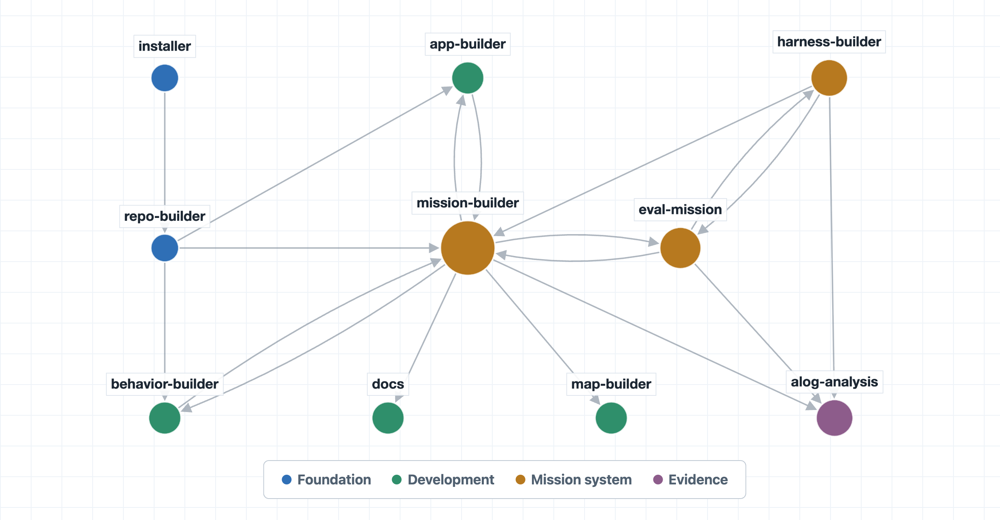

# MOOS-IvP Skills

Portable `SKILL.md` workflows for MOOS-IvP development: apps, behaviors,
missions, self-evaluating scenarios, test harnesses, documentation lookup, and
post-mission analysis.

The skills are intentionally interwoven. For example, `moos-ivp-mission-builder`
can use `moos-ivp-docs` to confirm behavior or app parameters in the initial
construction process, then use `moos-alog-analysis` to inspect runtime evidence.
Likewise, `moos-ivp-eval-mission-builder` explicitly starts with
`moos-ivp-mission-builder` for ordinary mission layout before adding
eval-specific headless launch, grading, `results.txt`, and completion
functionality.



The canonical skill source lives under `skills/`. Codex and Claude Code adapters
carry self-contained copies generated from that source for distribution.

## Skills

- `moos-ivp-mission-builder` - build and test ordinary MOOS-IvP mission folders.
- `moos-app-builder` - build or modify user-owned MOOS apps.
- `ivp-behavior-builder` - build or modify user-owned IvP helm behaviors.
- `moos-ivp-docs` - consult upstream MOOS-IvP docs and local source.
- `moos-alog-analysis` - analyze existing `.alog` files with MOOS log tools.
- `moos-ivp-installer` - install or repair an upstream MOOS-IvP checkout.
- `moos-ivp-eval-mission-builder` - build self-evaluating test missions.
- `moos-ivp-harness-builder` - build multi-case test harnesses, including `nspatch` variants.
- `moos-map-builder` - create and verify TIFF background maps through a GUI or CLI.

## Install

For Codex or Claude Code, copy the GitHub link:

```text
https://github.com/cbenjamin23/moos-ivp-skills
```

Then add it as a plugin marketplace in the Codex or Claude Code GUI, or ask the
agent to install the `moos-ivp-skills` plugin from that link.

If you are not using Codex or Claude Code, use the canonical `skills/`
directory directly. Ask your agent or harness to copy or load the skill folders
from `skills/` into the place it expects skill-style instructions.

For more detailed instructions, see `INSTALL.md`.

## Repository Layout

```text
skills/                  Canonical, agent-neutral skill folders.
plugins/codex/...        Codex plugin adapter.
plugins/claude/...       Claude Code plugin adapter.
INSTALL.md               Install commands and MOOS-IvP path setup.
docs/                    User and maintainer documentation.
scripts/                 Maintainer sync, validation, and release helpers.
```

## Customize a Skill

You can keep the plugin installed while providing your own local version of a
skill. Give the local skill the same unqualified name, such as
`moos-app-builder`, and explicitly describe it as the preferred local
replacement.
Unqualified references and automatic selection will then favor the local
workflow, while the original plugin skill remains available through its
plugin-qualified name.

See [Customizing Skills](docs/customizing-skills.md) for locations, examples,
explicit invocation syntax, update considerations, and the differences between
Codex and Claude Code.
